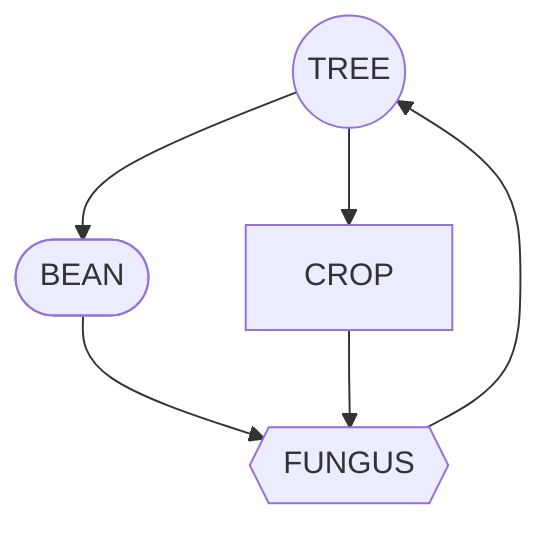

---
aliases:
tags:
---

# Seed Vaults

Seed Vaults have been a mainstay of interstellar colony management since the [pre-expansion era](../Empire%20in%20Snapshots/The%20Expansions/pre-expansion-era.md) when vaults were filled with plants seeds engineered for creating simple ecospheres. As [colony management](../Concepts/colony-management.md) developed as a science seed vaults became fundamental infrastructure for new colonies. Eventually these vaults would house not merely seeds but genetic libraries for rebuilding entire ecosystems.

## Pre-Expansion

The seed vaults of the pre-expansion era resembled the seed vaults of the ancient earth. Essentially environmentally controlled warehouses. The environmental controls developed beyond what was available to ancient earth in order to survive the transit of space travel. 

These seed vaults were packed with a diversity of plants and fungal species selected for their complementary life cycles. This effort to create rudimentary ecosystems often failed in the early colonies. However the experimental data was crucial to the development of future seed vaults and the genetic banks that would succeed them. These simple ecologies predominantly relied on a triumvirate of crop, bean, and tree, supported by a fungus.

The relatively crude attempts at ecological engineering often resulted in failure with colony farms being unable to maintain stable nutrient cycles. This heavy reliance on imported foodstuffs and fertiliser tied early colonial economies closely to Earth.

## First Empire 

