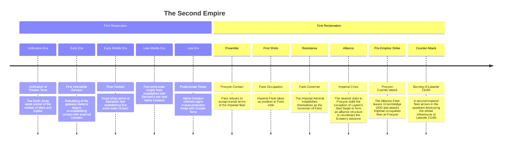

---
aliases:
tags:
---

```mermaid
timeline
	title The Second Empire
		section First Restoration
			Unification Era : Unification of Greater Terra :  The Earth  Junta takes control of the orbitals of Mars and Jupiter
			Early Era : First Interstellar Surveys : Rebuilding of the gateway stations begins re-establishing contact with external colonies
			Early Middle Era : First Contact : Scout ships arrive at Barnard's Star establishing first extra-solar contact 
			Late Middle Era : First extra-solar supply lines established with Barnard's star and Alpha Centauri
			Late Era : Protectorate Treaty : Alpha Centauri colonies signs mutual protection treaty with Greater Terra

		section First Reclamation
			Preamble : Procyon Contact : Paris refuses to accept transit terms of the Imperial fleet
			First Shots : Paris Occupation : Imperial Fleet takes up position in Paris orbit 
			Resistance : Paris Governer : The Imperial Admiral establishes themselves as the Governer of Paris 
			Alliance : Imperial Crisis : The nearest stars to Procyon (with the exception of Luyten's Star) begin to form an alliance structure to counteract the Empire's advance
			Pre-Emptive Strike : Procyon Counter-attack : The Alliance Fleet leaves Groombridge 1830 and attacks Imperial occupation fleet at Procyon 
			Counter Attack : Burning of Lalande 21185 : A second Imperial fleet arrives in the quadrant destroying the orbital infrastructe of Lalande 21185  

```
