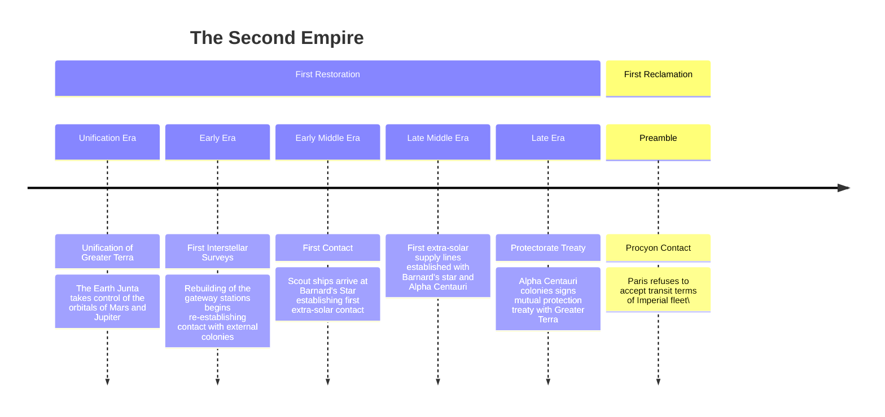

---
aliases:
tags:
---

```mermaid
timeline
	title The Second Empire
		section First Restoration
			Unification Era : Unification of Greater Terra :  The Earth  Junta takes control of the orbitals of Mars and Jupiter
			Early Era : First Interstellar Surveys : Rebuilding of the gateway stations begins re-establishing contact with external colonies
			Early Middle Era : First Contact : Scout ships arrive at Barnard's Star establishing first extra-solar contact 
			Late Middle Era : First extra-solar supply lines established with Barnard's star and Alpha Centauri
			Late Era : Protectorate Treaty : Alpha Centauri colonies signs mutual protection treaty with Greater Terra

		section First Reclamation
			Preamble : Procyon Contact : Paris refuses to accept transit terms of Imperial fleet\
			
```
