---
aliases:
tags:
---

# The Expansions

```mermaid
timeline
    section Pre-Expansion
        Early Era   : First Colonists
                    : Generally thought of as occurring before the Pre-Expansion Era the time of the first colonists is the first documented attempts to settle extraoslar worlds with human beings.
        Late Era    : First Diaspora
                    : Considered to be the start of the extrasolar age the first citizen conglomerates begin funding colony ships. Some Colonies recieved corporate backing.
                    
    section First Expansion
        Early Empire    : Second Diaspora
                        : Driven by the Brush Fire Wars, a wave of expansion emerges from the peripheral systems of the early First Empire.
        Middle Empire   : Outposts
                        : The difficulty of interstellar communication keeps the empire confined to the Orion Spur, however a number of autonomous outposts are funded. 
        Late Empire     : Third Diaspora
                        : Greater Terra begins driving funding for expansive colonisation efforts, supported by rapid advances in ansible technology.

    section Inter-Expansion
        Post Fall       : Fourth Diaspora
                        : The fatal collapse of the Greater Terran empire resulted in an exodus of colony ships to escape the chaos.
        Contraction     : Local Expansions
                        : In the wake of the first collapse of mankind's empire self-sufficient colonies rise and fall in stellar kingdoms. Although few new colonies are settled, orbital infrastructure continues to expand.
                        
    section Second Expansion
        Early Kingdom   : Fifth Diaspora
                        : Although definitionally contested as to whether it was a true diaspora, the early fleets of the Terran Kingdom brought many abandoned and lost colonies uunder its control.
        Conquest Era    : Sixth Diaspora
                        : The Conquest was a violent expansion of the new Second Empire, expanding to swallow the surviving colonies and kingdoms that had grown in the Sagittarius Arm of the galaxy.
        Imperial Survey : Private Expansion
                        : Financial support for colonial settlement is restricted with resources allocated to the development of existing colonies. Imperial survey fleets continue to expand to the Empire's reach, while private colony ships follow in their wake.
        High Empire     : The Grand Diaspora
                        : With the Empire secure in resources and command of its extrasolar territories undisputed a mass of colonisation efforts swarm out across the Sagittarius Arm, the Perseus Arm, and the Sapis Arm. The fledging colonies that had struggled to build lives in the wake of the surveys are absorbed, subjugated, or crushed.

    section Post-Expansion Era
        Recession       : Collapse of the Second Empire
                        : Stretched out beyond any control of its territory Greater Terra cedes power to any local authority pledging loyalty. The Imperial Fleets were ordered to return to the home systems to command the loyalty of the industrial worlds. The most peripheral colonies and habitats are left to their own devices. Some failing, or simply disappearing into the moras of record keeping.
        Suffering Era   : Invasion
                        : The scattering of the human species across the galactic arm felt like little safeguard for extinction when the Rampant appeared at the edges of the Perseus Arm. The following centuries saw the scouring of numerous world and habitats. The ecological devastation of not only the core world but Greater Terra itself would cripple the flourishing of a new civilisation.
        Emergence       : Interimperial Period
                        : Although the Second Empire was ruin, their victory cost the Rampant their own survival. Beset by ravenous hordes and dormant nests, surviving colonies began to rebuilding what they could. The notable Jacobian Kingdom expanding its dominion with an eye to Empire itself, before collapsing.
    
    section Third Expansion
		Reclamation     : Crusades
						: The burgeoning Third Empire begins to assault Rampant positions capturing planets and orbital infrastructure.
```



<!---
```timeline-labeled
[line-2, body-4]
date: Early Pre-Expansion %%Year 1200 (Before Empire)%%
title: [First Colonists](../Empire%20in%20Snapshots/The%20Expansions/pre-expansion-era.md#First%20Colonists)
content:
Generally thought of as occurring before the [Pre-Expansion Era](pre-expansion-era.md) the time of the first colonists is the first documented attempts to settle extraoslar worlds with human beings.

date: Late Pre-Expansion %%Year 800 (Before Empire)%%
title: [First Diaspora](pre-expansion-era.md#First%20Diaspora)
content:
Considered to be the start of the extrasolar age the first citizen conglomerates begin funding colony ships. Some Colonies recieved corporate backing.

date: First Expansion %%Year 300 (Before Empire)%%
title: [Second Diaspora](first-expansion.md#Second%20Diaspora)
content:
Driven by the [Brush Fire Wars](imperial-brush-fires.md), a wave of expansion emerges from the peripheral systems of the early [First Empire](first-empire.md)

date: Exploration %%Year 1200 (First Empire)%%
title: [Outposts](outposts.md)
content: 
The difficulty of interstellar communication keeps the empire confined to the [Orion Spur](galactic-features-and-local-quadrants.md#Orion%20Spur), however a number of autonomous outposts are funded. 

date: First Expansion %%Year 3300 (First Empire)%%
title: [Third Diaspora](firs-expansion.md#Third%20Diaspora.md)
content: 
[Greater Terra](greater-terra.md) begins driving funding for expansive colonisation efforts, supported by rapid advances in [Ansible](superluminal-communication.md) technology.

date: Inter Expansion %%Year 4400 (Collapse)%%
title: [Fourth Diaspora](second-expansion.md#Fourth%20Diaspora)
content: 
The fatal collapse of the [Greater Terran](greater-terra.md) empire resulted in an exodus of colony ships to escape the chaos.

date: Inter Expansion %%Unknown year%%
title: [Local Expansions](inter-expansion-years.md#Local%20Expansions)
content:
In the wake of the first collapse of mankind's empire self-sufficient colonies rise and fall in stellar kingdoms. Although few new colonies are settled, orbital infrastructure continues to expand.

date: Second Expansion %%Year 300 (Before Conquest)%%
title: [Fifth Diaspora](second-expansion.md#Fifth%20Diaspora)
content:
Although definitionally contested as to whether it was a true diaspora, the early fleets of the [Terran Kingdom](second-empire.md) brought many abandoned and lost colonies uunder its control.

date: Second Expansion %%Year 130 (Empire)%%
title: [Sixth Diaspora](second-expansion.md#Sixth%20Diaspora)
content: 
The *Conquest* was a violent expansion of the new [Second Empire](second-empire.md), expanding to swallow the surviving colonies and kingdoms that had grown in the [Sagittarius Arm](galactic-features-and-local-quadrants.md#Sagittarius%20Arm) of the galaxy.

date: Imperial Surveys %%Year 2100 (Empire)%%
title: [Private Expansion](second-empire.md#Imperial%20Surveys)
content: 
Financial support for colonial settlement is restricted with resources allocated to the development of existing colonies. Imperial survey fleets continue to expand to the Empire's reach, while private colony ships follow in their wake.

date: Second Expansion %%Year 4302 (Empire)%%
title: [The Grand Diaspora](second-expansion.md#Seventh%20Diaspora%20-%20the%20Grand%20Diaspora)
content:  
With the Empire secure in resources and command of its extrasolar territories undisputed a mass of colonisation efforts swarm out across the [Sagittarius Arm](galactic-features-and-local-quadrants.md#Sagittarius%20Arm), the [Perseus Arm](galactic-features-and-local-quadrants.md#Perseus%20Arm), and the [Sapis Arm](galactic-features-and-local-quadrants.md#Sapis%20Arm). The fledging colonies that had struggled to build lives in the wake of the surveys are absorbed, subjugated, or crushed.

date: Stagnation %%Year 5800 (Empire)%%  
title: [Collapse](second-empire.md#Collapse)
content:  
Stretched out beyond any control of its territory [Greater Terra](greater-terra.md) cedes power to any local authority pledging loyalty. The Imperial Fleets were ordered to return to the home systems to command the loyalty of the industrial worlds. The most peripheral colonies and habitats are left to their own devices. Some failing, or simply disappearing into the moras of record keeping. 

date: The Invasion %%Year 6200 (Empire)%%  
title: [The Suffering](rampant.md)
content: 
The scattering of the human species across the galactic arm felt like little safeguard for extinction when the [Rampant](rampant.md) appeared at the edges of the [Perseus Arm](galactic-features-and-local-quadrants.md#Perseus%20Arm). The following centuries saw the scouring of numerous world and habitats. The ecological devastation of not only the core world but [Greater Terra](greater-terra.md) itself would cripple the flourishing of a new civilisation.

date: Emergence 
title: [Interimperial Period](the-stalgentae.md#Between%20the%20First%20and%20Second%20Empires)
content: 
Although the Second Empire was ruin, their victory cost the [Rampant](rampant.md) their own survival. Beset by ravenous hordes and dormant nests, surviving colonies began to rebuilding what they could. The notable [Jacobian Kingdom](jacobian-kingdom.md) expanding its dominion with an eye to Empire itself, before collapsing.
```
-->